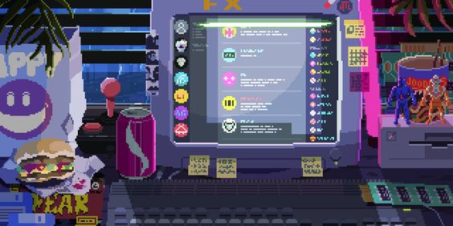

  

	
	

<h1 align="center">Hi  I am Marília Borgo! </h1>

<h2 align="center"> Estagiária | Estudante  </h2>

  

  

  

  
  
  ### Some facts about me:
- 🔭 I’m currently studying Sistems for internet :grin:
- 🌱 And working for Buser
- 💬 Ask me about anything, I am happy to help :smile:
- ⚡ Fun fact: I love to listen to music while coding!
  

